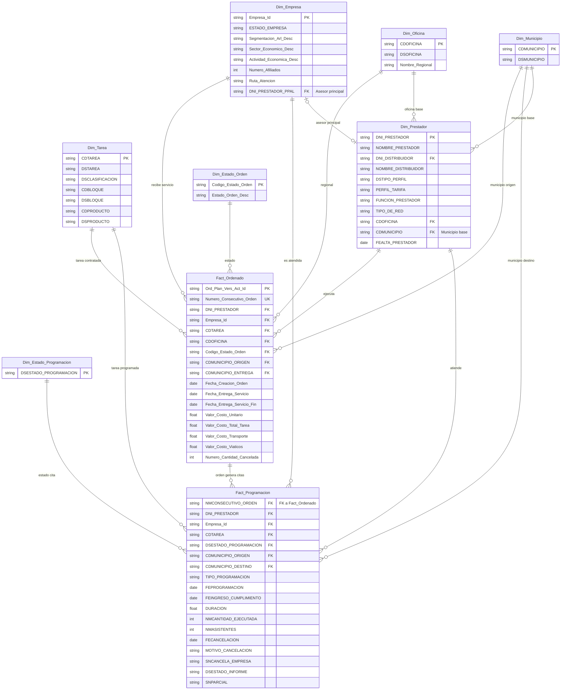

# Diagrama Entidad-Relacion — Reto SURA 2026

Esquema logico propuesto para analitica, derivado de los 4 datasets en Parquet. Notacion crow's foot (Mermaid `erDiagram`).

Para referencia de columnas completas, ver [`DESCRIPCION_DATOS.md`](DESCRIPCION_DATOS.md).

---

## Modelo actual (4 datasets)

```mermaid
erDiagram
    Detalle_Empresa {
        string Empresa_Id PK
        string ESTADO_EMPRESA_CALCULADO
        string ESTADO_EMPRESA
        string ID_PROFESIONAL_PPAL FK "FK a DNI_PRESTADOR"
        date Fecha_Inicio_Cobertura
        date Fecha_Fin_Cobertura
        string Actividad_Economica_Desc
        string Ind_Multiregional
        string Ind_Afiliada
        string Afiliados
        int Numero_Afiliados
        string Sector_Economico_Desc
        string Segmentacion_Arl_Desc
        string GRUPO_ECONOMICO_ARL_ID
        string UEN_PPAL_ARL_ID
        string Ruta_Atencion
    }

    Tareas_Prestador_Bloque {
        string DNI_PRESTADOR PK "PK compuesta con CDTAREA"
        string NOMBRE_PRESTADOR
        string DNI_DISTRIBUIDOR
        string NOMBRE_DISTRIBUIDOR
        string CDOFICINA
        string DSOFICINA
        string CDPRODUCTO
        string DSPRODUCTO
        string CDBLOQUE
        string DSBLOQUE
        string CDTAREA PK "PK compuesta con DNI_PRESTADOR"
        string DSTAREA
        string DSCLASIFICACION
        string DSTIPO_PERFIL
        string PERFIL_TARIFA
        string FUNCION_PRESTADOR
        float CAPACIDAD
        string CDMUNICIPIO
        string DSMUNICIPIO
        string TIPO_DE_RED
        date FEALTA_PRESTADOR
    }

    Ordenado {
        string Ord_Plan_Vers_Act_Id PK
        string Numero_Consecutivo_Orden UK "Llave de integracion con programaciones"
        string Dni_Prestador FK "FK a DNI_PRESTADOR"
        string Nombre_Prestador
        string Dni_Distribuidor
        string Nombre_Regional
        string Dni_Empresa FK "FK a Empresa_Id"
        string Nombre_Empresa
        string Codigo_Tarea FK "FK a CDTAREA"
        string Tarea_Desc
        string Codigo_Estado_Orden
        string Estado_Orden_Desc
        date Fecha_Creacion_Orden
        date Fecha_Entrega_Servicio
        date Fecha_Entrega_Servicio_Fin
        float Valor_Costo_Unitario
        float Valor_Costo_Total_Tarea
        float Valor_Costo_Transporte
        float Valor_Costo_Viaticos
        string Municipio_Origen_Desc
        string Municipio_Entrega_Desc
        string Clasificacion_Desc
        string Tipo_Red_Desc
        int Numero_Cantidad_Cancelada
        int Numero_Version
    }

    Tareas_Programadas_Canceladas {
        string NMCONSECUTIVO_ORDEN FK "FK a Numero_Consecutivo_Orden"
        string DNI_PRESTADOR FK "FK a DNI_PRESTADOR"
        string NOMBRE_PRESTADOR
        string DNI_DISTRIBUIDOR FK
        string NOMBRE_DISTRIBUIDOR
        string TIPO_DE_ASESOR
        string DNI_EMPRESA FK "FK a Empresa_Id"
        string DSNOMBRE_EMPRESA
        string NPOLIZA
        string CDTAREA FK "FK a CDTAREA"
        string DSTAREA
        string CLASIFICACION
        string CDPRODUCTO
        string DSPRODUCTO
        string DS_MUNICIPIO_ORIGEN
        string DS_MUNICIPIO_DESTINO
        string TIPO_PROGRAMACION "Campo o Informe"
        date FEENTREGA_SERVICIO_INI
        date FEENTREGA_SERVICIO_FIN
        date FEPROGRAMACION
        date FEINGRESO_CUMPLIMIENTO
        float DURACION
        int NMCANTIDAD_EJECUTADA
        int NMASISTENTES
        string DSESTADO_PROGRAMACION "7 estados"
        date FECANCELACION
        string MOTIVO_CANCELACION "70K+ valores unicos"
        string SNCANCELA_EMPRESA
        string DSESTADO_INFORME
        date FEAPROBACION_INFORME
        string SNAPROBADO_AUTOMATICO
        string SNPARCIAL
    }

    Detalle_Empresa ||--o{ Ordenado : "empresa genera ordenes"
    Detalle_Empresa ||--o{ Tareas_Programadas_Canceladas : "empresa tiene programaciones"
    Detalle_Empresa |o--|| Tareas_Prestador_Bloque : "asesor principal asignado"
    Tareas_Prestador_Bloque }o--o{ Ordenado : "prestador asignado a ordenes"
    Tareas_Prestador_Bloque }o--o{ Tareas_Programadas_Canceladas : "prestador ejecuta tareas"
    Ordenado ||--o{ Tareas_Programadas_Canceladas : "orden tiene citas programadas"
```

### Llaves de integracion

| Llave                        | Origen                               | Destino                                                  |
| ---------------------------- | ------------------------------------ | -------------------------------------------------------- |
| `DNI_PRESTADOR`              | Tareas_Prestador_Bloque              | Ordenado (`Dni_Prestador`), Tareas_Programadas, Detalle_Empresa (`ID_PROFESIONAL_PPAL`) |
| `CDTAREA` / `Codigo_Tarea`   | Tareas_Prestador_Bloque              | Ordenado, Tareas_Programadas                             |
| `Empresa_Id` / `Dni_Empresa` | Detalle_Empresa                      | Ordenado, Tareas_Programadas (`DNI_EMPRESA`)             |
| `Numero_Consecutivo_Orden`   | Ordenado                             | Tareas_Programadas (`NMCONSECUTIVO_ORDEN`)               |
| `DNI_DISTRIBUIDOR`           | Tareas_Prestador_Bloque              | Ordenado (`Dni_Distribuidor`), Tareas_Programadas        |

---

## Esquema normalizado propuesto (star schema para analitica)

---

## Notas

- **Tipos de dato**: Todos los datos crudos se ingestan como `string` (`infer_schema_length=0`). Los tipos mostrados (`date`, `float`, `int`) son los casteos propuestos para la capa Silver/Gold.
- **Claves compuestas**: `Tareas_Prestador_Bloque` usa clave compuesta `(DNI_PRESTADOR, CDTAREA)`. Mermaid no soporta PKs compuestas nativamente; ambas columnas estan marcadas como PK con comentario.
- **`MOTIVO_CANCELACION`**: Tiene 70.000+ valores unicos (texto libre). Requiere limpieza con NLP antes de poder usarse como dimension. Considerar crear `Dim_Motivo_Cancelacion` con categorias agrupadas.
- **`ID_PROFESIONAL_PPAL`**: FK implicita en `Detalle_Empresa` que referencia a un prestador (`DNI_PRESTADOR`). No todos los registros tienen asesor asignado.
- **Columnas omitidas**: El diagrama muestra columnas clave para analitica. Para el listado completo ver [`DESCRIPCION_DATOS.md`](DESCRIPCION_DATOS.md). Ordenado tiene 100 columnas totales, Tareas_Programadas 62.
