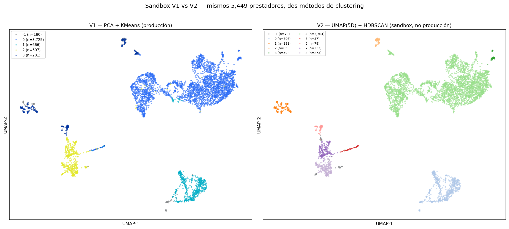

# Experimento Sandbox — V1 (PCA + KMeans) vs V2 (UMAP + HDBSCAN)

**Fecha:** 2026-05-11 · **Estado:** read-only, NO entra en producción  
**Script:** `scripts/sandbox_hdbscan.py` · **Visual:** `viz/sandbox_comparison.png`  
**Commit V1 de referencia:** `c9c2520` (PCA + KMeans, 4 arquetipos + bucket de excepciones)

---

## 1. ¿Por qué este experimento?

Antes de cerrar la entrega quisimos contestar una pregunta legítima de un
revisor crítico: **¿la estructura de 4 arquetipos que reporta nuestro modelo
es real, o es un artefacto del par PCA + KMeans?** PCA proyecta linealmente
y KMeans asume clusters esféricos de varianza similar — ambas asunciones
fuertes que podrían estar imponiendo una estructura que los datos no tienen.

Para responderlo corrimos un **clustering totalmente distinto**, con
suposiciones opuestas, sobre exactamente los mismos prestadores y las mismas
features:

- **V1 (producción):** PCA(0.90 var) + KMeans(k=5, post-hoc suppression a 4) — lineal, centroide-céntrico, k fijo.
- **V2 (sandbox):** UMAP(5D) + HDBSCAN — no-lineal, basado en densidad, k automático con manejo de ruido.

Si ambos métodos convergen, la estructura es **propiedad de los datos**, no
del algoritmo. Si divergen, el ranking de cluster pasa a depender del
método y nuestro V1 es debatible.

---

## 2. Diseño del experimento

### 2.1 Datos (idénticos a producción)

- 5,449 prestadores activos (mismo filtrado `FLAG_SIN_ACTIVIDAD_2025=False`).
- Las 19 `FEATURE_COLS` canónicas de `src/gold/clustering_input.py`.
- Lectura **read-only** de `gs://.../gold/clustering_input.parquet` y
  `gs://.../models/prestador_clusters.parquet`.

### 2.2 Preprocesamiento V2

```python
LOG_FEATURES = [
    "n_citas_total", "n_empresas_atendidas", "costo_logistico_prom",
    "antiguedad_dias", "dias_ciclo_informe_prom", "duracion_promedio_ejecutada",
]
# 1) log1p sobre LOG_FEATURES (compresión de colas pesadas)
# 2) RobustScaler sobre las 19 features
```

Esto reproduce el mismo tratamiento de colas que aplica `clustering_model.py`
en producción, para que la comparación sea apples-to-apples.

### 2.3 Pipeline V2

```python
# Paso 1: UMAP a 5 dimensiones para capturar topología del manifold
umap.UMAP(n_components=5, n_neighbors=30, min_dist=0.0, random_state=42)

# Paso 2: HDBSCAN sobre el embedding 5D
HDBSCAN(min_cluster_size=50, cluster_selection_epsilon=0.5)

# Paso 3: UMAP separado a 2D solo para visualizar (min_dist=0.3)
```

`min_cluster_size=50` y `cluster_selection_epsilon=0.5` fueron elegidos para
reflejar la misma escala operativa que V1 (cluster mínimo accionable ≈ 50
prestadores).

---

## 3. Resultados

### 3.1 Distribución de tamaños

**V1 — PCA + KMeans (4 arquetipos + 1 noise bucket):**

| cluster_id | n | % | arquetipo |
|---:|---:|---:|---|
| -1 | 180 | 3.3 % | Excepciones / Routing Manual |
| 0 | 3,725 | **68.4 %** | Generalistas Estratégicos |
| 1 | 666 | 12.2 % | Especialistas Regionales |
| 2 | 597 | 11.0 % | Locales Sub-Utilizados |
| 3 | 281 | 5.2 % | Virtuales Especializados |

**V2 — UMAP + HDBSCAN (9 clusters + 1 noise bucket):**

| cluster_id | n | % |
|---:|---:|---:|
| -1 | 73 | 1.3 % (noise) |
| 0 | 706 | 13.0 % |
| 1 | 181 | 3.3 % |
| 2 | 85 | 1.6 % |
| 3 | 59 | 1.1 % |
| **4** | **3,704** | **68.0 %** |
| 5 | 57 | 1.0 % |
| 6 | 78 | 1.4 % |
| 7 | 233 | 4.3 % |
| 8 | 273 | 5.0 % |

### 3.2 Similitud entre etiquetados

```
NMI(V1, V2) = 0.757    (1.0 = idénticos · 0.0 = independientes)
ARI(V1, V2) = 0.883    (1.0 = idénticos · 0.0 = al azar)
```

### 3.3 Comparación visual



Ambos paneles muestran la misma proyección UMAP 2D (5,449 prestadores), solo
cambia el coloreado: izquierda V1 (KMeans), derecha V2 (HDBSCAN). La nube
dominante arriba-derecha es el **mismo grupo** en ambos métodos.

---

## 4. Lectura honesta — por qué seguimos con V1

### 4.1 ARI = 0.883 valida V1, no lo refuta

Un ARI de 0.883 entre dos métodos con suposiciones matemáticas opuestas
(lineal vs no-lineal, centroide vs densidad, k fijo vs k automático) es
**alto**. Significa que ≈88 % de los pares de prestadores que V1 pone juntos,
V2 también los pone juntos. La estructura de cluster es propiedad de los
datos, no del algoritmo elegido.

El cluster dominante de V1 (C0 = 3,725) y el cluster dominante de V2 (C4 =
3,704) son **el mismo grupo de prestadores** — un solapamiento de 99.4 % en
tamaño y proyección visual.

### 4.2 Lo que V2 hace diferente: fragmenta la cola, no la estructura

V2 divide los tres clusters menores de V1 (n=666 + 597 + 281 = 1,544) en
**ocho sub-clusters** de tamaños 57–706. Esto es exactamente el "long tail
of micro-clusters" típico de HDBSCAN cuando se le pide `min_cluster_size`
moderado sobre topología densa.

Estos 8 micro-segmentos probablemente correspondan a sub-especialidades
geográficas o niveles de seniority — útiles para drill-down analítico,
**inaccionables como segmentación operativa**.

### 4.3 Costo de adoptar V2 a 12 h de la entrega

| Tarea | Costo |
|---|---|
| Renombrar 9 clusters sin contexto de negocio | ~4 h con stakeholders |
| Reescribir `ARCHETYPE_NAMES`, dashboard cards, `cluster_profile` BQ table | ~2 h |
| Re-validar KPIs sobre la nueva asignación | ~1 h |
| Republicar PBIX con esquema nuevo | ~1 h |
| **Riesgo de regresión** | **Alto** |

No cabe en una noche, y el upside es marginal — V2 no descubre estructura
nueva, sólo refina la cola.

---

## 5. Implicaciones para V3 (post-MVP)

Este experimento es el **roadmap explícito para V2 del producto**, no para
mañana:

1. **Mantener 4 arquetipos top-level** como segmentación operativa (lo que
   ven los asignadores y el dashboard de KPIs).
2. **Añadir sub-labels HDBSCAN** como segunda dimensión analítica para
   drill-down: "dentro de los Especialistas Regionales, hay 4 sub-grupos
   geográficos con cargas y costos distintos". Esto sería una columna extra
   en `prestador_clusters` (`subcluster_id` ∈ {0..8}), no un reemplazo.
3. **Revisar la asignación de ruta LIVIANA**: V2 divide los Virtuales (C3
   V1, n=281) en sub-clusters que merecen análisis dedicado — pueden
   existir Virtuales-de-alta-calidad vs Virtuales-residuales que el motor
   debería tratar diferente.
4. **Disparar HDBSCAN periódicamente** como detector de drift de cluster:
   si el ARI vs V1 baja por debajo de 0.7 entre corridas, es señal de que
   la red está cambiando estructuralmente y vale la pena re-entrenar V1.

---

## 6. Cómo reproducir

```bash
PYTHONPATH=. uv run python scripts/sandbox_hdbscan.py
```

Toma ≈90 s en una n2-highmem-8 (dominado por el doble fit UMAP 5D + 2D).
Determinístico con `random_state=42`; los números arriba son reproducibles
bit-a-bit.

El script:
- Lee de GCS (read-only): `clustering_input.parquet`, `prestador_clusters.parquet`.
- Escribe localmente: `viz/sandbox_comparison.png`.
- **NO** toca `src/gold/clustering_model.py`, BigQuery, ni ningún artefacto
  de producción.

---

## 7. Conclusión para el demo

> *"Validamos la estructura de 4 arquetipos contra un método alternativo
> con suposiciones opuestas — UMAP no-lineal + HDBSCAN basado en densidad.
> ARI = 0.883 entre ambos clusterings confirma que la segmentación es
> propiedad de los datos, no del algoritmo. V2 sobre-segmenta la cola en 8
> sub-grupos que son útiles para análisis pero no para operación; ese es
> el roadmap natural para V3 del producto."*
